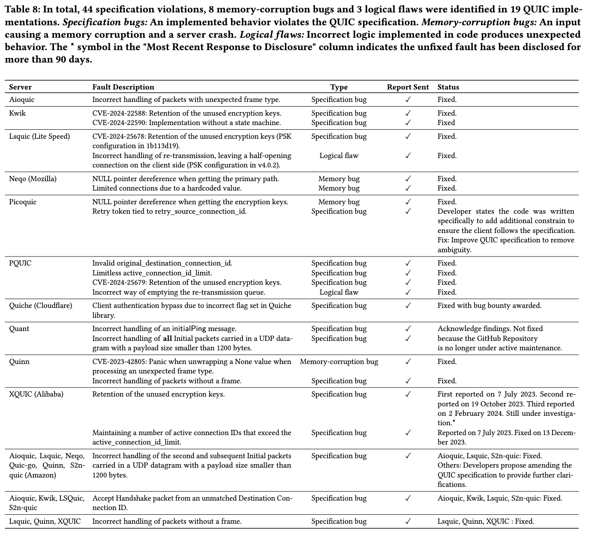

# QUICTester

### Total faults found: 55 (5 CVEs assigned: [CVE-2023-42805](https://nvd.nist.gov/vuln/detail/CVE-2023-42805), [CVE-2024-25679](https://nvd.nist.gov/vuln/detail/CVE-2024-25679), [CVE-2024-25678](https://nvd.nist.gov/vuln/detail/CVE-2024-25678), [CVE-2024-22588](https://nvd.nist.gov/vuln/detail/CVE-2024-22588), [CVE-2024-22590](https://nvd.nist.gov/vuln/detail/CVE-2024-22590))
- **44 specification violations** (An implemented behavior violates the QUIC specification.)
- **8 memory-related bugs** (An input causing a memory corruption and a server crash.)
- **3 logic flaws** (Incorrect logic implemented in code produces unexpected behavior.)

#### CVEs
- [CVE-2023-42805](https://nvd.nist.gov/vuln/detail/CVE-2023-42805)
- [CVE-2024-25679](https://nvd.nist.gov/vuln/detail/CVE-2024-25679)
- [CVE-2024-25678](https://nvd.nist.gov/vuln/detail/CVE-2024-25678)
- [CVE-2024-22588](https://nvd.nist.gov/vuln/detail/CVE-2024-22588)
- [CVE-2024-22590](https://nvd.nist.gov/vuln/detail/CVE-2024-22590)

### Faults that are resolved after disclosure. 

### 19 QUIC implementations tested with 186 learned models
Basic: Basic handshake 
Retry: Handshake with client address validation 
ClientAuth: Handshake with client authentication 
RetryClientAuth: Handshake with client address validation and authentication 
PSK: Handshake with pre-shared key 

