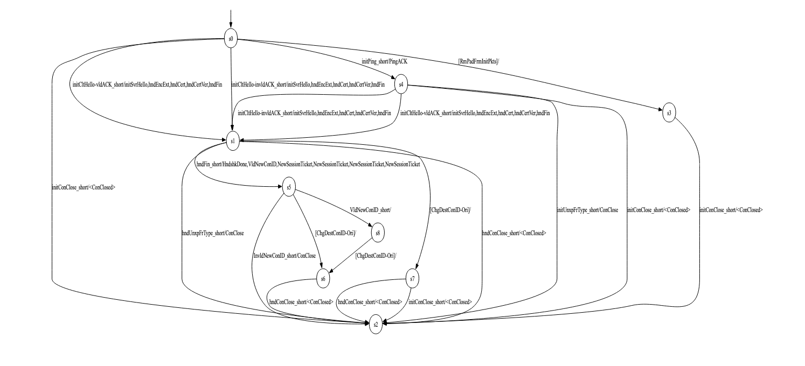

## Optimiser

Figure 1: The learned model of Quinn---notably the QUIC implementation with the valid FSM---in the most simple, **Basic** configuration before optimization. This illustration, whilst not fully legible, is provided to show an example of the complexity created in even the most basic security configuration for a learned model before optimization. The model after using our Optimiser is shown in Figure 2 below.

Figure 2: The learned model of Quinn **Basic** after employing our Optimiser (compared with Figure 1 above generated prior to simplification, there are far fewer edges, greatly improving *interpretability* and the task of model analysis).