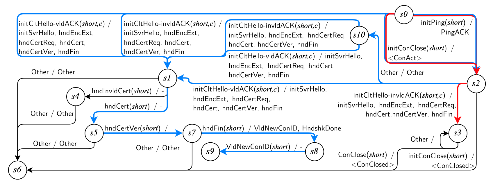
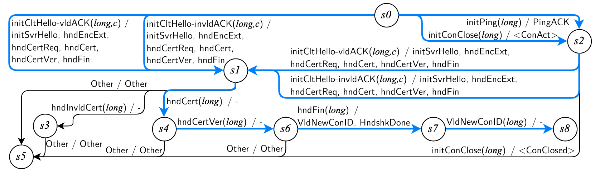

# M-4

## Bug Description
Upon attempts to retransmit a previously sent packet, a null pointer is dereferenced while parsing the list. This is caused by an incorrect method of pruning the re-transmission queue in ```picoquic/sender.c:picoquic_implicit_handshake_ack()```. Should be ```p->previous_packet``` instead of ```p->next_packet```. This bug crashes the server, allowing an attacker to perform a DoS attack on the server.

## Impacted Servers & Versions
Picoquic (Tested on commit d2f01093)

## Fixed Version
This bug was fixed in commit 4f695ac.

## Input Sequence
[Input.INITIAL_PING, Input.INITIAL_CLIENT_HELLO_INVALID_ACK]

## Complete Model of Figure 6 (Moved from paper)

Figure 1: An optimized model from Picoquic with **ClientAuth** configuration learned with ```t=short``` parameter setting for inputs. Differental analysis with Figure 2 below using ```t=long``` reveals a software bug exploit.


Figure 2: An optimized model from Picoquic with **ClientAuth** configuration learned with ```t=long``` parameter setting for inputs.

