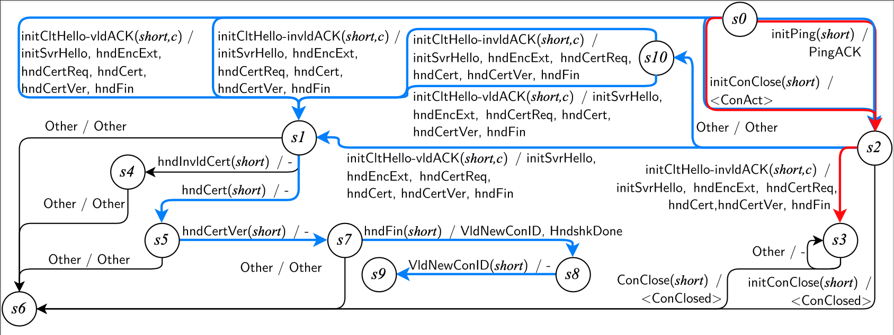

# QT6

## Bug Description
Upon attempts to retransmit a previously sent packet, a null pointer is dereferenced while parsing the list. This is caused by an incorrect method of pruning the re-transmission queue in ```picoquic/sender.c:picoquic_implicit_handshake_ack()```. Should be ```p->previous_packet``` instead of ```p->next_packet```. This bug crashes the server, allowing an attacker to perform a DoS attack on the server.

## Impacted Servers & Versions
Picoquic (Tested on commit d2f01093)

## Fixed Version
This bug was fixed in commit 4f695ac.

## Input Sequence
[Input.INITIAL_PING, Input.INITIAL_CLIENT_HELLO_INVALID_ACK]

## Learned Model
The learned model below illustrates the flow of this bug (highlighted in red colour).

