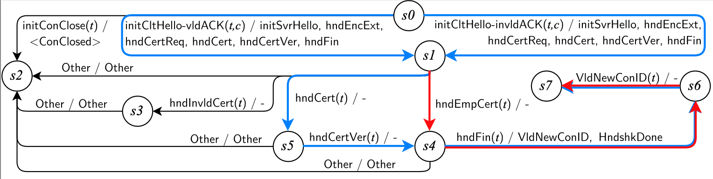
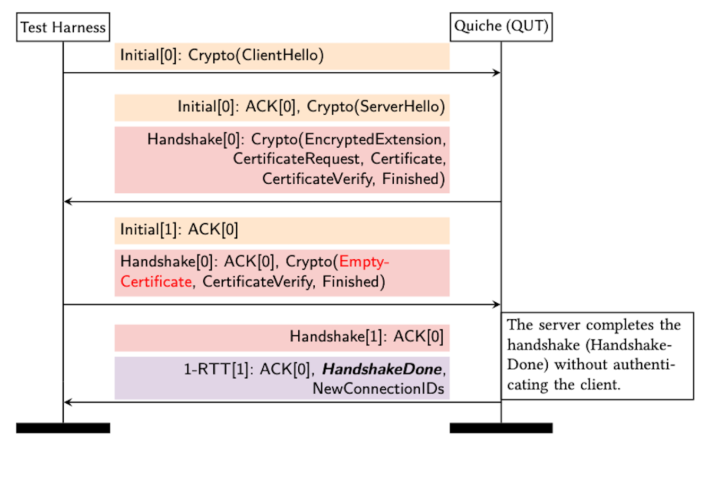

# S-12

## Bug Description
During our code analysis of Quiche, we discovered the developers had set the incorrect flag for verifying the peer certificate in the source code used to configure BoringSSL. If the client provides an empty certificate to a Quiche server, the client will not be authenticated, and will proceed with the handshake without authentication.

## Impacted Servers & Versions
Quiche (Tested on commit 24a959ab)

## Fixed Version
This bug has been fixed with another Cloudflare API without any modification in Quiche's source code. The developers have clarify the usage of client authentication in the documentation.

## Input Sequence
[Input.INITIAL_CLIENT_HELLO_VALID_ACK, Input.HANDSHAKE_EMPTY_CERTIFICATE, Input.HANDSHAKE_FINISHED]

## Complete Model of Figure 5 (Moved from paper)

Figure 1: Optimized learned model of a Quiche server with the **ClientAuth** configuration. Blue edges show a valid path to complete a QUIC handshake. Red edges demonstrate an invalid path that bypasses the client authentication, but still completes the handshake without errors.

## Summarised Flow (Moved from paper)

Figure 2: Client authentication bypass in Quiche. The invalid (EmptyCertificate) message is shown in *red text*.